# Lab Exercise 3: Introduction to the Paleobiology Database and Paleodiversity

### Ackwowledgement
This lab was originally created by [Andrew Zaffos](https://github.com/aazaff/teachPaleobiology), and has been modified by Noel Heim.

## Instructions

Complete the following lab exercise and submit your answers as Word, Pages, or PDF document and your R script as a .r file by the start of lab on September 26, 2019. Please submit your files by email to noel.heim@tufts.edu.

## Finding the Paleobiology Database Website

The URL for the Paleobiology Database is [www.paleobiodb.org](https://paleobiodb.org). Go there now in your web browser. The first thing that you should see is the **SPLASH** page. 

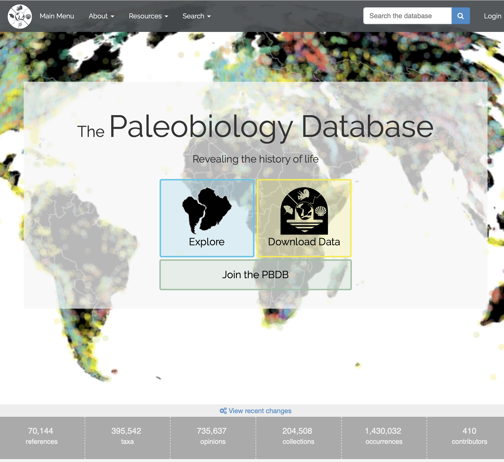

The Paleobiology Database (**PBDB** for short) splash page has a lot of information packed into it. At the bottom of the screen you will see some basic stats on the types and quantity of data located in the database.

Data Type | Definition
--------- | ----------
**References** | Scientific articles, books, monographs, or other sources of data.
**Taxa** | A taxon (plural taxa) is a group of one or more populations of an organism or organisms seen by taxonomists to form a unit. 
**Opinions** | Different opinions on the correct taxonomic name/identification of different fossil taxa.
**Collections** | A group (collection) of fossil taxa at a specific location.
**Occurrences** | An individual observation of a taxon at a specific location.
**Scientists** | The number of scientists that are *officially* involved in the Paleobiology Database initiative.

## References

All data in the PBDB can ultimately be traced back to one or more references. To search for references, click on the *Search* button at the top left (not the search field on the top right) the select *Published references*.

The references search page should look something like this.
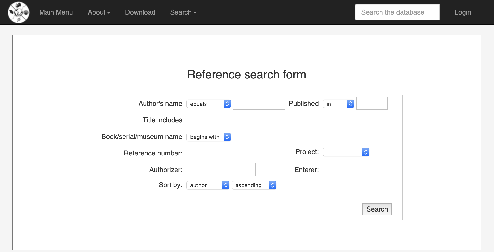

#### Exercise Questions 1

Let's take a look at a great scientific paper by Steven M. Holland and Mark E. Patzkowsky. 

<a href="url">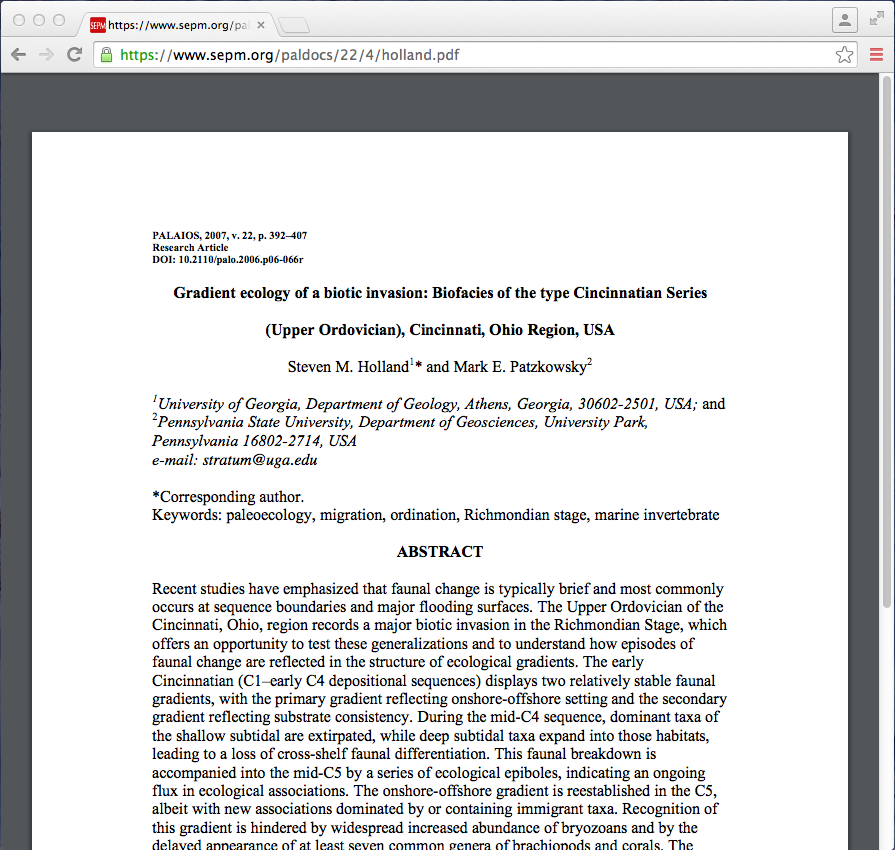</a>

Use the reference search tool to look up collections associated with this paper and answer the following questions.

1. How many collections are associated with this references?

2. What is the reference id number for the article? 

Once you have answered the above questions, click the **view collections** hyperlink to see a print out of the collections associated with the study.

<a href="url">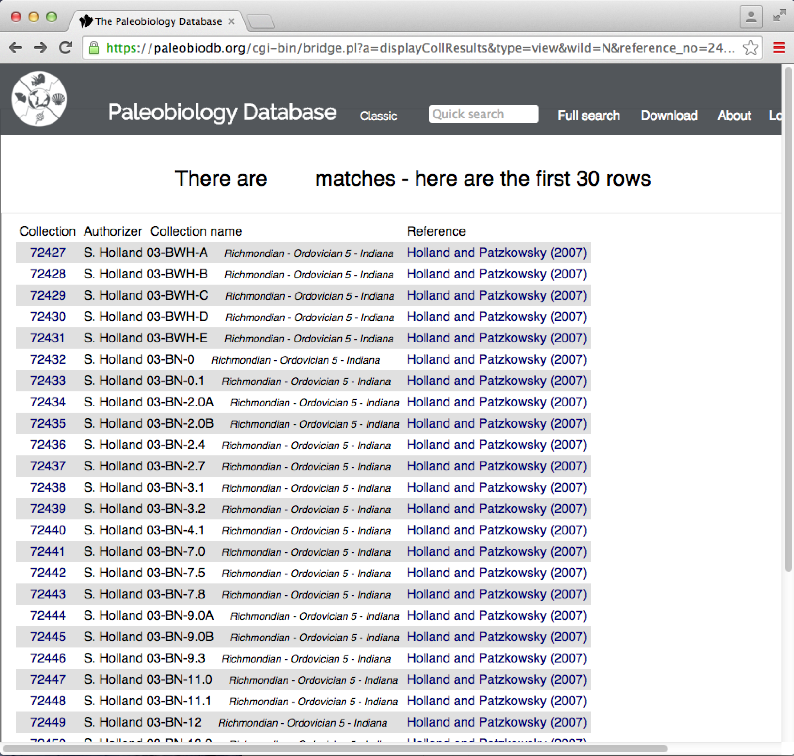</a>

Click on collection no. **72438**. Answer the following questions about this collection.

<a href="url">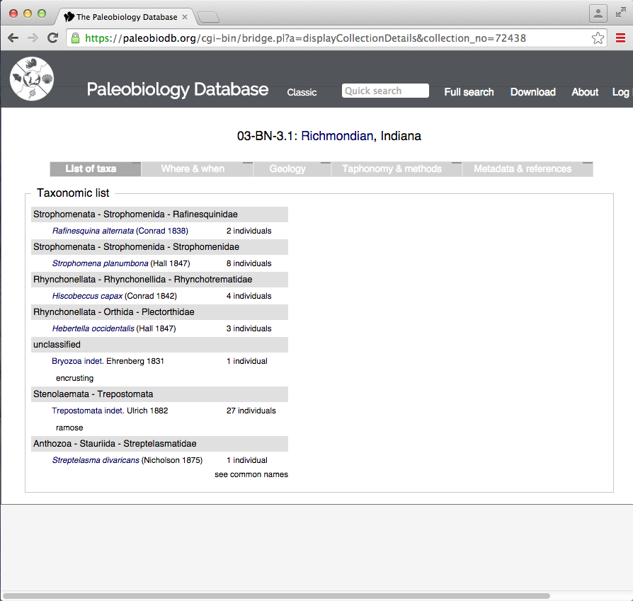</a>

3. The first taxon in the taxonomic list is *Rafinesquina alternata*. Next to the taxonomic name is the citation (Conrad 1830), what is the significance of this citation?

4. What is the *class*, *order*, *family*, *genus*, and *species* name of the second taxon in the taxonomic list?

5. In what County was the data collected?

6. What age (Period) is the data from?

7. What is the geologic formation where the data was found?

## Collections

Collections are useful for getting additional information about the age, location, and geologic context of collected fossils. They are, however, generally a poor tool for data analysis. This is because there is no standard operational definition of a collection in the Paleobiology Database.

For example, collection **72438** from the above example represents a single sample from the study by Holland and Patzkowsky. In that study, a sample represents a single *bedding plane* (i.e., the top of a single rock layer) between 100 cm<sup>2</sup> and 1600 cm<sup>2</sup> in size.

In contrast, collection **91240** represents a single sample in a study by Ivany et al. 2009, Ref# 30540. In that study, a sample was defined as an entire rock outcrop (multiple beds), generally several square meters in extent. 

If you blindly compared these two collections, you would be making an apples and oranges comparison.

## Occurrences

Occurrences are the number of collections that contain a taxon. Since the size and definition of collections is variable, the meaning of occurrences is also somewhat imprecise. 

Therefore, as we progress in this class, you will see that often times the first step of any data analysis project using the PBDB is to reorganize occurrences into a more sensible and standardized format. We will discuss occurrences more when discussing how to download data.

#### Exercise Questions 2

Return to the **SPLASH** page, and enter the PBDB Navigator by clicking on [Explore](https://paleobiodb.org/navigator/) tool. This tool is the best way to visualize the age and location of collections in the PBDB.

<a href="url">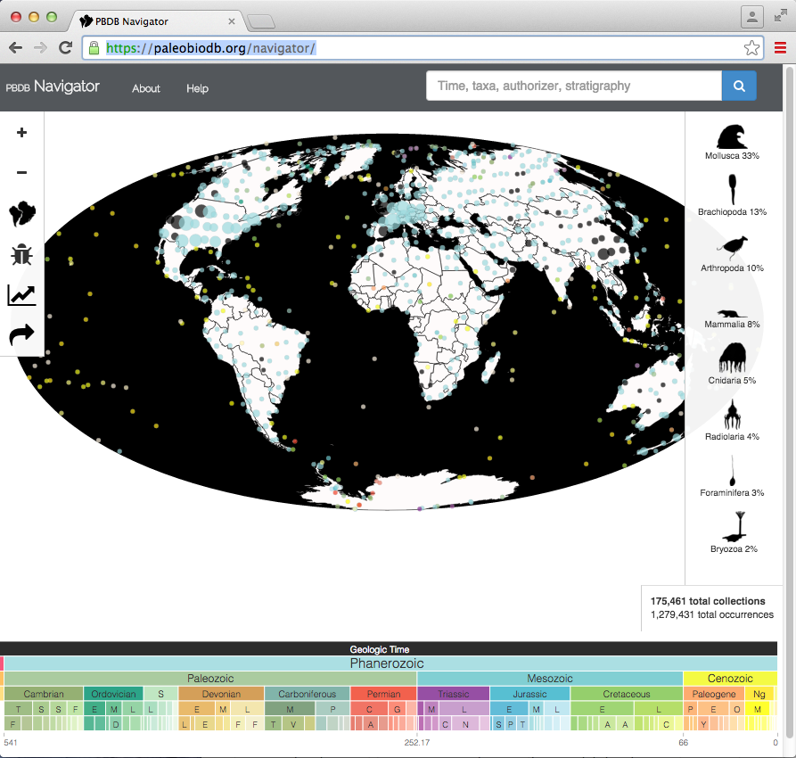</a>

Look at the search bar prompt in the top right corner. Navigator will allow you to enter a geologic time period, a taxon, an authorizer, or a geologic unit. Let's look for the genus *Abra*.

<a href="url">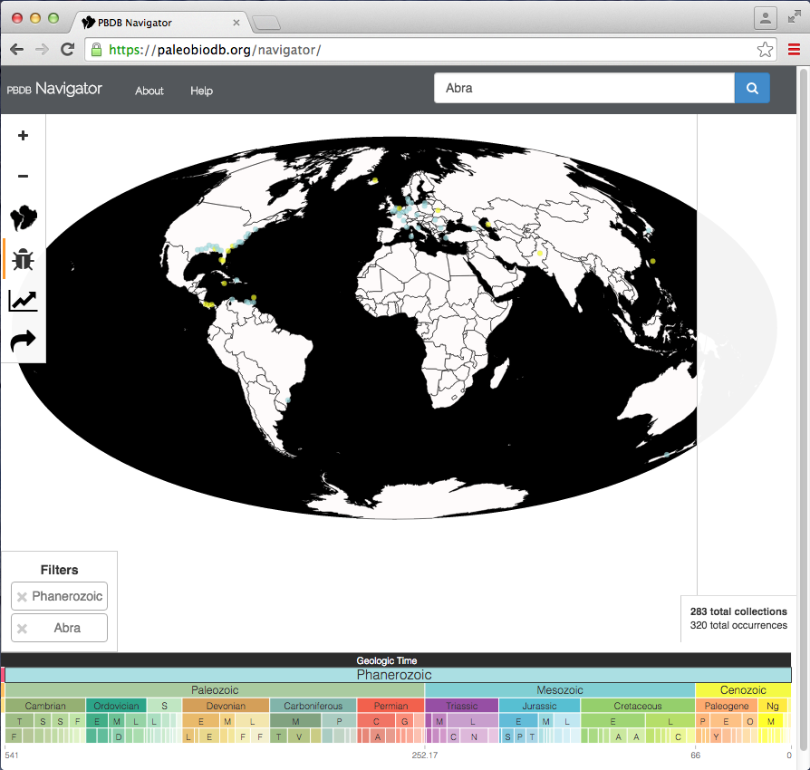</a>

1. Zoom in so that you can see from Texas to Florida and from Florida to New York. You can zoom using the mouse wheel, by double-clicking, or clicking the **+** and **-** signs. Some of the occurrences are orange and others are yellow, what is the significance of the different colors?

2. Zoom back out. Add an additional filter into the search bar, the Ypresian stage. The Ypresian is a time interval ranging from 47.8–56.0 million years ago. In what countries are there Ypresian occurrences of *Abra*?

3. Clear the *Abra* and Ypresian filters from the search. Look for the genus *Ambonychia*. Within the United States find the city with the most occurrences of *Ambonychia*. What is the name of this city? 

4. What age (Period) are most *Ambonychia* occurrences?

Add in your answer to question 4 as an additional filter. Click on the little icon of South America breaking away from Africa on the left side of the screen. This icon rotates the continents back to their position in the specified time-period. **Note that it requires you to have set a specific time-period as a filter**. 

5. During this time-period, were most occurrences of *Ambonychia* arrayed parallel or perpendicular to the equator?

6. Click on the little insect icon on the left side of the screen. This brings up taxonomic information on the target taxon. What order does *Ambonychia* belong to?

## Downloading Data

You can download the data displayed in your Navigator window using the little arrow icon on the left side of the screen, but its options are limited. 

To customize the data you want, use the new and more detailed download form. To find the form, return to the **SPLASH** page and click on [Download Data](https://paleobiodb.org/cgi-bin/bridge.pl?a=displayDownloadGenerator). This download form uses the new Paleobiology Database **API**. Once you are more advanced, you will be able to download data directly into R using the **API**, and will no longer need to use Navigator or the download form.

<a href="url">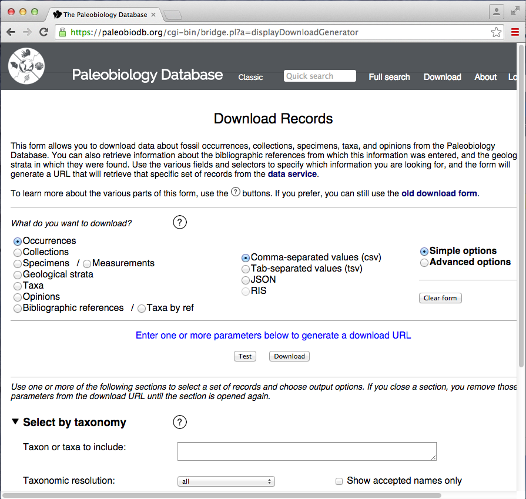</a>

Let's try downloading all collections of both *Ambonychia* and *Abra* as a tab-separated file. 

1. Select Collections
2. Select Tab-separated values (tsv)
3. Enter Abra, Ambonychia into the Taxon textbar.

<a href="url">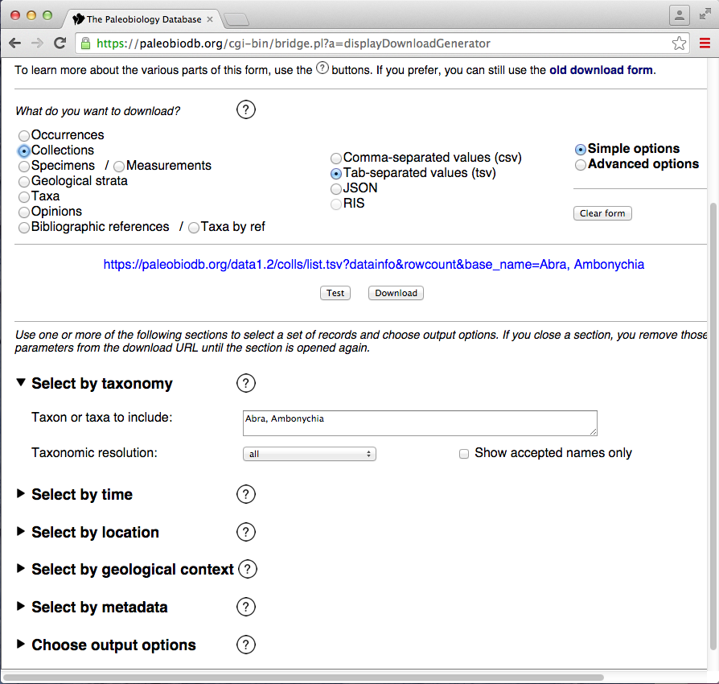</a>

If you were successful you should have gotten a blue URL, describing your data request.

https://paleobiodb.org/data1.2/colls/list.tsv?datainfo&rowcount&base_name=Abra,Ambonychia

#### Exercise Questions 3

For the following questions generate the appropriate URL for the following data queries.

1. What is the appropriate URL for downloading all occurrences of *Ambonychia* in the Lexington Limestone as a JSON?

2. What is the appropriate URL for downloading all occurrences of mammals present in the Paleocene through Oligocene epochs as a csv?

3. What is the appropriate URL for downloading all opinions on the order Testudines in the Mesozoic?

4. What is the appropriate URL for downloading all collections of Aves, Marsupialia, and Sirenia in the United States as a csv?

5. What is the appropriate URL for downloading all occurrences of the gastropod genus *Ficus* as a csv (Hint: There is also a *plant* genus named *Ficus*)?

#### Exercise Questions 4

The next set of questions is free form, in that you can find the answer to the following questions using any of the PBDB tools discussed so far.

1. What family does the genus *Gastrocopta* belong to?

2. There is only once occurrence of *Isoetes* in Portugal. What age is it?

3. What is the age of the oldest occurrence of *Gastrocopta*?

4. There is only one occurrence of *Tiktaalik* in the Paleobiology Database? Was that occurrence located in the tropics or the extratropics when it was alive?

5. There are two occurrences of *Namacalathus* in Sibera. What geologic formations are they found in?

## Paleobiology Database API

The acronym API stands for Application Programming Interface. Technical definitions aside, it is a way for users to access data stored in an online database through web addresses (URLs). Companies that store a lot of data (e.g., Google, Twitter, Facebook) make API's available so that 3rd party developers can use their data to make applications. For example, if you've ever played a Facebook game (e.g., Candy Crush, Farmville), those programs were accessing information about you and your friends through the API.

The best way to think about using an API is to imagine it as a map to all the data stored online. You need to use this map to give the computer directions on how to find the particular data you want and access it. When we give directions to a location in the real world, we generally do so in two ways. We either give geographic coordinates (i.e., latitude, longitude, elevation) that specify the destination, or a set of routes to get somewhere (e.g., Take I-90 E to Chicago, then I-80 W to Joliet).

When we access data in R via **subscripting** (`Object[ ]`), we are using a coordinate system to point out the data in our object. In contrast, when we access data through an API we are defining a **route**. In fact, route is the formal terminology. Depending on the size of an API there may be dozens of routes, which may feel overwhelming at first. However, remember that a car map has thousands or hundreds of thousands of roads, most of which you will never travel upon, but you still know how to use a map. It is the same way with an API.

Let's deconstruct a specific API **query** (i.e., URL).

````
https://paleobiodb.org/data1.2/occs/list.csv?base_name=Smilodon&interval=Pleistocene
````

The following figure deconstructs each element of this query.

<a href="url">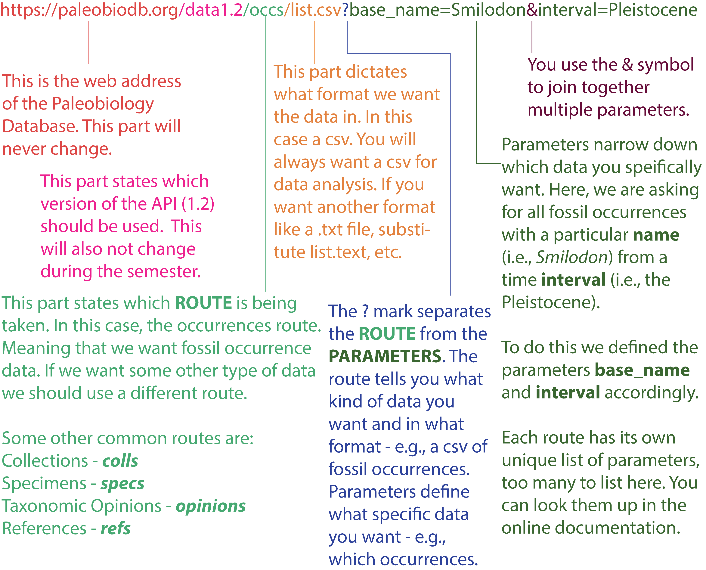</a>

The first half of the query, before the **?** is fairly straightforward because there are only a few possible variations. However, the **parameters** that come afterwards can become quite cumbersome because there are many varieties of them, and many of them will change depending on what type of data you are using (i.e., collections vs. occurrences). You will need to use the documentation to see a full list of the possible paramters.

+ [Occurrences Parameters](https://paleobiodb.org/data1.2/occs/list_doc.html)
+ [Collections Parameters](https://paleobiodb.org/data1.2/colls/list_doc.html)
+ [References Parameters](https://paleobiodb.org/data1.2/refs/list_doc.html)
+ [Opinions Parameters](https://paleobiodb.org/data1.2/opinions/list_doc.html)
+ [Specimens Parameters](https://paleobiodb.org/data1.2/specs/list_doc.html)

You can also access the API documentation from the main SPLASH page.

<a href="url">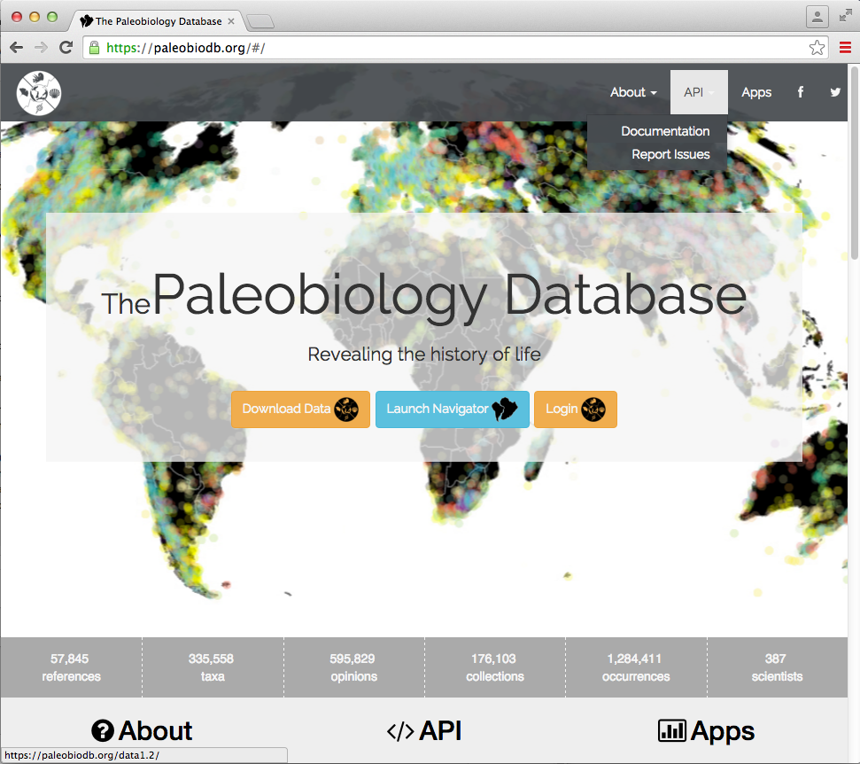</a>

This will take you to a page that lists the different data routes. If you click on those routes, it will take you to pages that describe different parameters associated with the chosen route. Let's take a breather though and answer some questions.

#### Exercise Questions 5

````R
https://paleobiodb.org/data1.2/colls/list.csv?base_name=Mammut&interval=Pliocene
````

1. What code would you use to download the above PBDB data directly into R? 

2. Download the above data into R. What are its dimensions?

3. Did the above call use the occurrences, collections, references, opinions, or specimens route?

4. What genus is being called for? What is its colloquial name? What age did I limit the data query too?

5. Look through the service documentation for the appropriate route (based on your answer to Question 2). Find out how to extend the age search to range from the Miocene Epoch through to the Pleistocene Epoch. Give the new data query URL.

6. I want the data query to show me the paleocoordinates (i.e., paleolatitude and paleolongitude) of each data point. Give the updated data query URL.

## Diversity, Origination and Extinction in R
In this final part of the lab exercise, you will construct a diversity curve and calculate origination and extinction rates for the bryozoan class Stenolaemata. 

In addition to answering the questions below, you will also need to submit a .r script containing your code for downloading data, calculations, and generating your plots. This script should be well documented (i.e., explanatory comments) and should run without error. You may need to review loops and plotting from [Getting Started with R](https://github.com/naheim/rTutorials/blob/master/manipulatedf.md).

**Downloading Your Data** You want to download Stenolaemata occurrences from the PBDB. You should do this in R by writing a URL and reading it in using a function like ``read.delim()``. However, you do not want to download every occurrence. For most studies of the fossil record that span multiple geological periods, we typically use genera as the focal taxonomic unit. So before you do any analyses you will want to exclude any occurrences that are not identified to at least the genus level (sometimes fossils can only be identified to family, order, etc.) and you want to lump congeneric species from the same collection into a single occurrence. Of course, you could do this relatively easily in R. However, you can add parameters to your call to the API that will do both of these tasks for you. The advantage of this is that you your script will be shorter and your initial download will be smaller--if you don't have a lot of memory on your computer this can be very valuable.

The parameter you want to use is ``idreso`` and you want to set it equal to ``lump_genus``. This will only return species that have been identified to genus or species, and lump species of the same genus in the same collection into a single occurrence.

Before you begin analyses, you also want to download a timescale. You can do this directly from the PBDB too! There is an API route for [timescale intervals](https://paleobiodb.org/data1.2/intervals/list_doc.html). The URL for getting geological stages for the Phanerozoic is:

````
https://paleobiodb.org/data1.2/intervals/list.tsv?scale=1&level=5
````

For this exercise you will make two plots. One for diversity, calculated simply as the number genera extant during each time bin. The second plot will have both origination and extinction rates. For purposes of this lab exercise, you will calculate rates of origination and extinction as percents. This is probably the most commonly use metric, but there are others. Percent rates have the advantages of being simple to use and unless diversity is very small, percentages are robust to variations in sample size.

Once you have your dataset and timescale downloaded, you can start your calculations. Here are the steps you need to take in your code:

1. Download occurrences
2. Download timescale
3. Find the FADs and LADs for each genus. This is actually pretty straightforward using the apply family of functions. See the last section of [Getting Started with R](https://github.com/naheim/rTutorials/blob/master/manipulatedf.md).
4. Set up vectors to hold the diversity, origination, and extinction values.
5. Write a loop that will:
	* Subset all extant genera in time interval.
	* Count the number of extant genera in time interval.
	* Count the number of genera that go extinct in interval.
	* Count the number of genera that originate in interval.
	* Compute percent origination and extinction.
	* *Don't forget to save the appropriate count and calculations to the appropriate vectors*
6. Plot diversity over time. Be sure to have nice axis labels and the x-axis in the proper order.
7. Plot origination and extinction over time. For this, the ``lines()`` function will be helpful. It adds lines to existing plots without overwriting them. As always, pay attention to your axes and labels. Also note that if you call ``quartz()`` before making you second plot, it will open a new plot window for your second graph.

 

#### Exercise Questions 6
1. How many Stenolaemata genera and genus-level occurrences are in the PBDB?
2. When (Period) did Stenolaemata have their maximum genus diversity?
3. When did the Stenolaemata have their largest decline in diversity? Was this gradual or sudden?
4. When were the highest rates of extincton for Stenolaemata?
5. Why does 