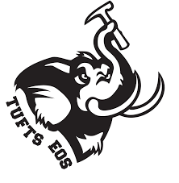

# Paleobiology Lab Exercises
### These exercises has been written for students taking the Paleobiology (EOS 38) course at Tufts University. Registered students need to submit your final lab reports through Canvas.

## Table of Contents
Lab | Topic | Report Due
--- | --- | ---
[Lab 3](lab3.md) | Paleobiology Database & Diversity | 26 September 2019
[Lab 4](lab4.md) | Macrostrat | 03 October 2019

