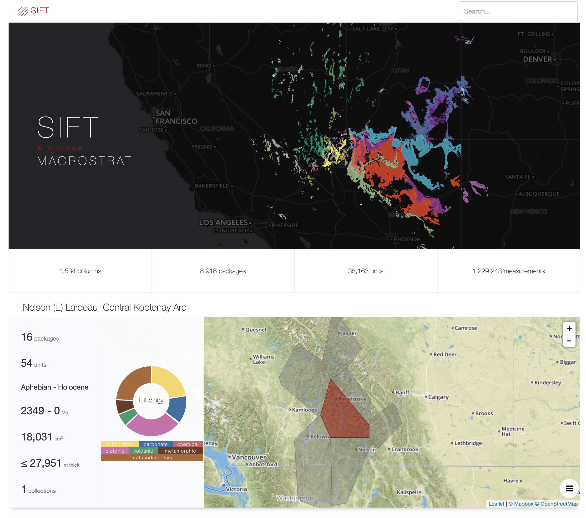
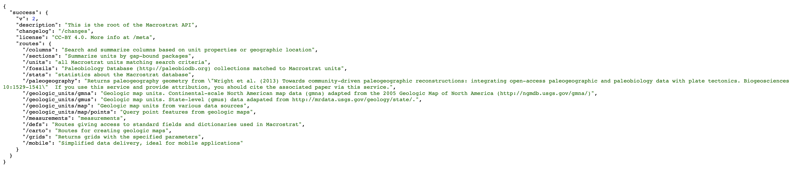

# Lab Exercise 4: Introduction to Macrostratigraphy & the Macrostrat Database

## Instructions

Complete the following lab exercise and submit your answers as Word, Pages, or PDF document and your R script as a .r file by the start of lab on October 3, 2019. Please submit your files by email to noel.heim@tufts.edu.

## Objectives
The purpose of this lab is to introduce you to the concepts of macrostratigraphy and the Macrostrat database. By the end of this lab you should be able to download Macrostrat data using the API. You will also be able to calculate macrostratigraphic parameters and compare the fossil and geological record using R.  

## Introduction
In the 1970s and 1980s the Geological Survey of Canada and the American Association of Petroleum Geologists produced a series of stratigraphic correlation charts that show the geology of North America from the crystalline basement to the surface at over 800 locations. These charts were indented to standardize the stratigraphic nomenclature of geologic units and allow geologists to easily determine which units are roughly equivalent. However, these charts also contain a wealth of information on the geology of North America, including lithology, thickness, paleoenvironments, and economic minerals. Although the effort that went into producing these charts have gone largely unnoticed by geologists, the Macrostrat database has digitized these, and similar, records in order to leverage for purposes other than correlation and name standardization. In this laboratory exercise you will use Macrostrat to explore the spatial and temporal dynamics of North American geology.

## The Nomenclature of Macrostratigraphy
* **Units**: In Macrostrat, the finest division is called a unit and roughly corresponds to a formation-level lithostratigraphic unit. The colored boxes on figure 1 below are units.
* **Packages**: The key to macrostratigraphic analysis is recognizing unconformities, or 'gaps' in the geological record. Units are stacked into gap-bound packages--a vertical sequence of units with unconformities above and below that are resolvable to approximately 1 million years. In reality, most sedimentary units will have internal unconformities that are much shorter in duration than one million years, but these are not resolvalbe in the data used to construct Macrostrat. 
* **Columns**: Packages are stacked to form stratigraphic columns that summarize the geological history of a region.
* **Initiation**: The term used to describe what happens at the FAD of a package--the initiation of rock accumulation.
* **Truncation**: The term used to describe what happens at a package's LAD--the truncation of that package.

**Figure 1** *Example of Macrostrat columns, packages, and units. The key to macrostratigraphy is that packages, because they are bound above and bleow by undonformities, or 'gaps', can be treated analytically in the same way we treat species in the fossil record. Namely, each package has times of first and last appearance.*

## Finding the Macrostrat Website
The URL for the Macrostrat is [macrostrat.org](https://macrostrat.org). Go there now in your web browser. The first thing that you should see is the **SPLASH** page. 

The Macrostrat splash page has a lot of information packed into it. At the bottom of the screen you will see some basic stats on the types and quantity of data located in the database.

Data Type | Definition
--------- | ----------
**Regional Rock Columns** | Regional summaries of the rock record in a particular place. In nearly all cases, the columns describe the record from the surface down to crystalline basement rock.
**Rock Units** | A formation-level lithostratigraphic unit. Columns are composed of units. 
**Geologic Map Polygons** | Macrostrat also has global and regional geologic maps. Each map polygon corresponds to a colored geological map unit.

If you scroll down, you will see the four major projects currently part of Macrostrat.

## Macrostrat Units & Columns

Click on the *Search* button near underneath the Macrostrat stats on the splash page.

The page you get will be a randomly selected macrostrat column, and should look something like this.

You are presented with the location of the stratigraphic column on a maps as wells as some summary statistics about the column, including the numbers of units and packages, the distribution of lithologies, age range, total thickness, and area. You are also presented with the number of collections. This refers to the the number of paleobiology Database collections that have been matched to units in the column.

#### Exercise Questions 1
Search for 'Hindsville' in the search bar at the upper right. This will take you to the summary page for the units named Hindsville.

1. Where is the Hindsville located?

2. What age is the Hindsville? Give the period and stage names.

3. How thick is the Hindsville?

4. Why are there three columns that have Hindsville units?  

5. What proportion of the Hindsville is sandstone?

6. What are the prevalent taxa found in the Hindsville?

Click on the gray polygon that contains the city of Fayetteville. This will take you to the summary page for that column.

7. What is the name of the column?

8. How thick is the column?

9. How many PBDB collections have been matched to units in this column and what are the prevalent taxa?

At the bottom of the page is a graphical rendering of the units within the column.

10. How many packages are in this column and how are the delineated on the figure?

11. How many units have PBDB collections?

12. What are the units above and below the Hindsville? Are each of these units in the same or different packages?

## Macrostrat API

Unlike the PBDB, Macrostrat does not provide a form for downloading data. However, like the PBDB, it does have an API. The API has the general form as the PBDB API, but the documentation is not nearly as verbose. To get to the API, click on the API link on the splash page. You should end up at a splash screen for the API documentation that looks like this.

To get to the main documentation click on **API root** or go directly to [macrostrat.org/api](http://macrostrat.org/api). You should see something that looks like this.

The documentation is formatted in JSON. You may want to add a free JSON parser extension for your browser. For Macs, I like use JSON Peep for Safari and JSON Lite for Firefox, but there are others for other browsers and operating systems.

* Projects via defs
* Download marine packages
* Download pbdb collections
* Plot history of rock quantity
* Plot number of collections
* Plot proportion of matched packages

The best way to think about using an API is to imagine it as a map to all the data stored online. You need to use this map to give the computer directions on how to find the particular data you want and access it. When we give directions to a location in the real world, we generally do so in two ways. We either give geographic coordinates (i.e., latitude, longitude, elevation) that specify the destination, or a set of routes to get somewhere (e.g., Take I-90 E to Chicago, then I-80 W to Joliet).

When we access data in R via **subscripting** (`Object[ ]`), we are using a coordinate system to point out the data in our object. In contrast, when we access data through an API we are defining a **route**. In fact, route is the formal terminology. Depending on the size of an API there may be dozens of routes, which may feel overwhelming at first. However, remember that a car map has thousands or hundreds of thousands of roads, most of which you will never travel upon, but you still know how to use a map. It is the same way with an API.