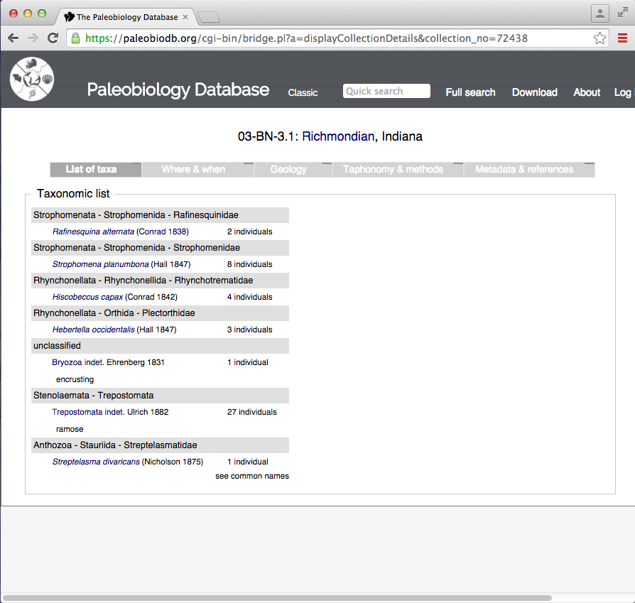

# Lab Exercise 4: Introduction to Macrostratigraphy & the Macrostrat Database

## Instructions

Complete the following lab exercise and submit your answers as Word, Pages, or PDF document and your R script as a .r file by the start of lab on October 3, 2019. Please submit your files by email to noel.heim@tufts.edu.

## Objectives
The purpose of this lab is to introduce you to the concepts of macrostratigraphy and the Macrostrat database. 

## Introduction
In the 1970s and 1980s the Geological Survey of Canada and the American Association of Petroleum Geologists produced a series of stratigraphic correlation charts that show the geology of North America from the crystalline basement to the surface at over 800 locations. These charts were indented to standardize the stratigraphic nomenclature of geologic units and allow geologists to easily determine which units are roughly equivalent. However, these charts also contain a wealth of information on the geology of North America, including lithology, thickness, paleoenvironments, and economic minerals. Although the effort that went into producing these charts have gone largely unnoticed by geologists, the Macrostrat database has digitized these, and similar, records in order to leverage for purposes other than correlation and name standardization. In this laboratory exercise you will use Macrostrat to explore the spatial and temporal dynamics of North American geology.

## The nomenclature of macrostratigraphy
* **Units**: In Macrostrat, the finest division is called a unit and roughly corresponds to a formation-level lithostratigraphic unit. The colored boxes on figure XX below are units.
* **Packages**: The key to macrostratigraphic analysis is recognizing unconformities, or 'gaps' in the geological record. Units are stacked into gap-bound packages--a vertical sequence of units with unconformities above and below that are resolvable to approximately 1 million years. In reality, most sedimentary units will have internal unconformities that are much shorter in duration than one million years, but these are not resolvalbe in the data used to construct Macrostrat. 
* **Columns**: Packages are stacked to form stratigraphic columns that summarize the geological history of a region.

**Figure X** *Example of Macrostrat columns, packages, and units. The key to macrostratigraphy is that packages, because they are bound above and bleow by undonformities, or 'gaps', can be treated analytically in the same way we treat species in the fossil record. Namely, each package has times of first and last appearance.*

## Finding the Macrostrat Website
The URL for the Macrostrat is [macrostrat.org](https://macrostrat.org). Go there now in your web browser. The first thing that you should see is the **SPLASH** page. 

The Macrostrat splash page has a lot of information packed into it. At the bottom of the screen you will see some basic stats on the types and quantity of data located in the database.

Data Type | Definition
--------- | ----------
**Regional Rock Columns** | Regional summaries of the rock record in a particular place. In nearly all cases, the columns describe the record from the surface down to crystalline basement rock.
**Rock Units** | A formation-level lithostratigraphic unit. Columns are composed of units. 
**Geologic Map Polygons** | Macrostrat also has global and regional geologic maps. Each map polygon corresponds to a colored geological map unit.

If you scroll down, you will see the four major projects currently part of Macrostrat.

## Macrostrat Columns

Click on the *Search* button near underneath the Macrostrat stats on the splash page.

The page you get will be a randomly selected macrostrat column, and should look something like this.

You are presented with the location of the stratigraphic column on a maps as wells as some summary statistics about the column, including the numbers of units and packages, the distribution of lithologies, age range, total thickness, and area. You are also presented with the number of collections. This refers to the the number of paleobiology Database collections that have been matched to units in the column.

#### Exercise Questions 1

Let's take a look at a great scientific paper by Steven M. Holland and Mark E. Patzkowsky. 

Use the reference search tool to look up collections associated with this paper and answer the following questions.

1. How many collections are associated with this references?

2. What is the reference id number for the article? 

Once you have answered the above questions, click the **view collections** hyperlink to see a print out of the collections associated with the study.

Click on collection no. **72438**. Answer the following questions about this collection.

3. The first taxon in the taxonomic list is *Rafinesquina alternata*. Next to the taxonomic name is the citation (Conrad 1830), what is the significance of this citation?

4. What is the *class*, *order*, *family*, *genus*, and *species* name of the second taxon in the taxonomic list?

5. In what County was the data collected?

6. What age (Period) is the data from?

7. What is the geologic formation where the data was found?
