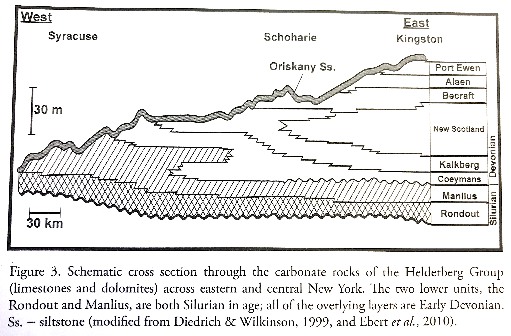
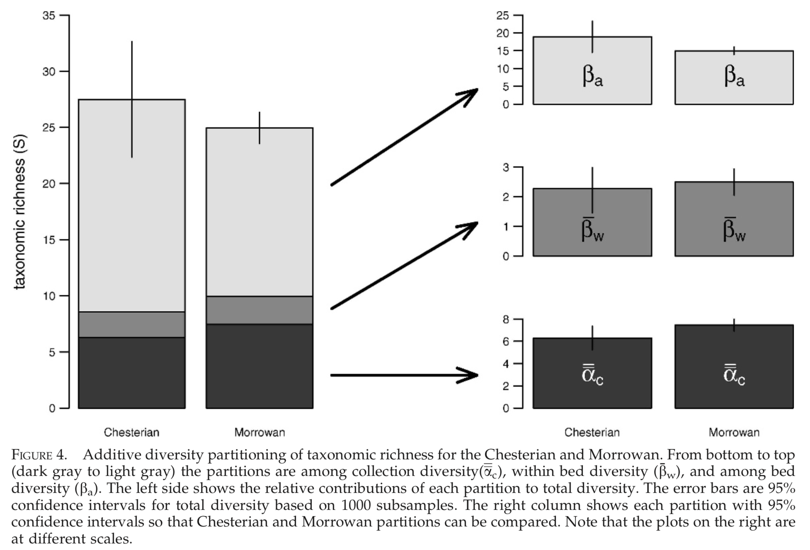
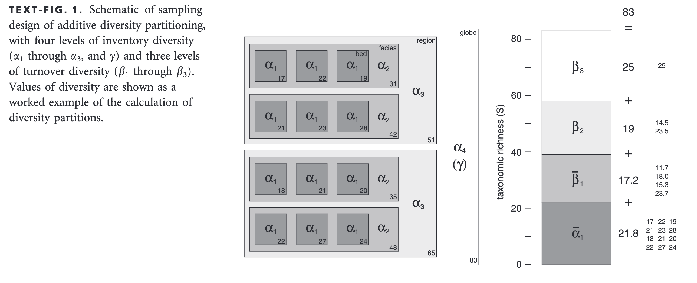
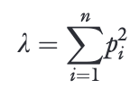

# Lab Exercise 7b: Community Diversity in the Early Devonian New Scotland Formation (samples collected on our field trip). 

## Instructions

Complete the following lab exercise and submit your answers as Word, Pages, or PDF document and your R script as a .r file by the start of lab on October 31, 2019 (:ghost: :jack_o_lantern: :skull:). Please submit your files by email to noel.heim@tufts.edu.

## Objectives
The purpose of this lab is to learn about biodiversity by measuring it in the samples we collected from the New Scotland formation earlier this month.

## Introduction
The New Scotland Formation is Early Devonian in age, belongs to the Helderberg Group, and is exposed in eastern New York. (See the figure below)


*Genarliaed stratigraphic column of the Lower Devonian (and Late Silurian) Helderberg Group in Eastern New York. Our samples came from the New Scotland Formation. (Wilson 2014* Field Guide to the Devonian Fossils of New York*).*

There are a variety of ways to think about diversity. The simplest, and most common, is to think of diversity simply as the number of species (or genera, families, etc.). This metric is called **species richness** or just **richness** (S). This is the main metric we will use in this lab.

# The Data
You can download the genus counts here: [https://raw.githubusercontent.com/naheim/paleoLabExercises/master/lab7bFigs/NewScotlandData.txt](https://raw.githubusercontent.com/naheim/paleoLabExercises/master/lab7bFigs/NewScotlandData.txt).

In this data frame, the first row is the bed number, the second column is the sample number, and the remainder of the columns are genus counts.

You can read this data file directly into R from GitHub. 

```` r
newScotland <- read.delim(file="https://raw.githubusercontent.com/naheim/paleoLabExercises/master/lab7bFigs/NewScotlandData.txt")
````

Look at the file and become familiar with its structure. The first column is a unique for each sample, the second column is an identifier for each bed (notice it repeats), and the third column (which is probably not necessary) indicates the sample within the bed.

After reading in the data frame, my recommendation is to split the data frame into two, with one data frame holding the sample information and a second holding the species counts.

```` r
sampleInfo <- newScotland[,1:3]
genusCounts <- newScotland[,-(1:3)]
````
The ``by()`` function will probably be helpful. It works like the apply family of functions, but takes a data frame or matrix as it's main argument rather than a vector. This is how you would use by to get the number of specimens in each sample, grouped by bed.

```` r
by(genusCounts, sampleInfo$Bed, rowSums)
````
Here is how you would use ``by()`` to get the number of specimens for each genus in each bed.

```` r
by(genusCounts, sampleInfo$Bed, colSums)
````
 
As an alternative, you can split the data frame into a *list* of data frames using the ``split()`` function.

```` r
beds <- split(genusCounts, sampleInfo$Bed)

# access individual beds by their bed name
beds$RHR6 # this is the sixth bed
````


#### Exercise Questions 1
1. How many total species did we find in the New Scotland Formation? How many individuals?
2. What is the total diversity of each of the six beds we sampled from the New Scotland Formation?
3. How does diversity change up-section, if at all (remember bed 6 was at the base of the section)?
4. Use rarefaction, as we did in class, to determine the diversity of each of the six beds at a common sample size. What is the common sample size? What is the rarefied diversity of each bed?
5. Write an R script that shows your calculations, including the rarefaction.

## Additive Diversity Partitioning

It is interesting to know how many species there are in a sample, bed, formation, etc. If we have this information, we can then make comparisons (perhaps using [rarefaction](https://github.com/naheim/rTutorials/blob/master/rarefaction.md) or some other sample standardization) between samples, formation, etc. However, we might also want to know how diversity changes through space or time. We can do this by taking a hierarchical approach to measuring biodiversity. 

Modern ecologists often consider the diversity at multiple levels. Alpha diversity (&alpha;) is defined as the diversity (simple richness or some other diversity measure) of a local sample taken from a homogeneous habitat, gamma diversity (&gamma;) is the diversity of a regional sample that includes multiple habitats, and beta diversity (&beta;) describes how diversity increases from the &alpha; level to the &gamma; level as samples are pooled. For example the number of ant species (:ant:) on Tuft's Academic Quad is a measure of &alpha; and &gamma; would be the total number of ant species in all of Middlesex County. Beta diversity, then is the diversity gained by pooling all of the local habitats in Middlesex County.

It must be true that &alpha; <= &gamma;. The diversity that is added by summing many local habitats to arrive at &gamma; is called turnover diversity or beta diversity (&beta;). In essence, beta diversity tells us how different local habitats are from each other. If local habitats are nearly identical in their species composition, &beta; will be low. If local habitats are all very different from each other, then &beta; will be very high. 

In the geological record, we can apply this model of hierarchical diversity to samples collected in the fossil record. If you recall, we sampled six beds from the outcrop, and took three (or sometimes four) samples from each bed. With this hierarchical sampling protocol, we can partition diversity into sample diversity, beta diversity within beds and beta diversity among beds. This is called **additive diversity partitioning**.

Below is an example of additive diversity partitioning for brachiopod communities from the Carboniferous of the southern Ozark Mountains. The same sampling protocol for the Ozark study was used as our study of the New Scotland Formation: multiple samples collected within beds and multiple beds collected within the two ages. 



We are going to calculate the additive diversity partitioning for our field samples. The general equation is &gamma; = &alpha; + &beta;<sub>1</sub> + &beta;<sub>2</sub>. Where

* &alpha; = mean S of all samples
* &beta;<sub>1</sub> = mean beta diversity within beds
* &beta;<sub>2</sub> = beta diversity among beds

In each instance of &beta;, it is calculated as the total diversity of the level minus the average of samples within the level. In our case, &beta;<sub>2</sub> is the difference between total richness and the mean diversity of the six beds. To calculate &beta;<sub>1</sub>, first calculate the &beta; diversity for each bed as the total bed diversity minus the average diversity of the three samples within the bed. &beta;<sub>1</sub> is then the average &beta; of all six sampled beds.

Calculate &alpha;, &beta;<sub>1</sub>, and &beta;<sub>2</sub> for the New Scotland data and suing S and the measure of diversity. It may be helpful to draw a diagram similar to the one below from Holland (2010) to help you keep your diversities and levels straight (note yours won't have as many levels).



#### Exercise Questions 2

1. What are &alpha;, &beta;<sub>1</sub>, and &beta;<sub>2</sub>?
2. Which contributes most to total diversity?
3. What does it mean for that level to contribute most to diversity?
4. Add to your R script code that calculates &alpha;, &beta;<sub>1</sub>, and &beta;<sub>2</sub> from the New Scotland Data and plots these values as bar plot (as in published examples above). (Hint use ``barplot()``.)


## Evenness
Another aspect of biodiversity is evenness, which is a measure of how numerically similar species are within a community. The figure blow depicts two communities of trees. Both communities have the same richness (S): four species. However, they are very different in evenness. Community 1 has high evenness because all four species have the same numbers of individuals while community 2 is low evenness because one species has many more individuals than the others.


*(Fig. Credit: https://ib.bioninja.com.au/options/option-c-ecology-and-conser/c4-conservation-of-biodiver/biodiversity.html)*

There are many different evenness metrics. The one we will use here is Simpson's D. Simpson's D is derived from Simpson's concentration (&lambda;), which is the probability that two randomly chosen individuals from a community belong to the same species. The equation is below.



where *p<sub>i</sub>* is the proportion of the community represented by species *i* and *n* is the total number of species.

The minimum value of &lambda; is 1/*S*, and this is when all species have the same abundance. Lambda is considered a measure of concentration because when it's low diversity is spread out among all the species and when it's high diversity is concentrated in a few. To convert Simpson's &lambda; into Simpson's D, a measure of eveness, we simply subtract &lambda; from one.

*D = 1 - &lambda;*

We can also apply additive diversity partitioning to measures of evenness, including Simpson's D. 


#### Exercise Questions 3

1. What are &alpha;, &beta;<sub>1</sub>, and &beta;<sub>2</sub>?
2. Overall, do you think the New Scotlant has high evenness or low eveness?
3. Which contributes most to total evenness?
4. What what it means for that level to contribute most to diversity?
5. Add to your R script code that calculates &alpha;, &beta;<sub>1</sub>, and &beta;<sub>2</sub> for Simpson's D and plots these values as bar plot (as in published examples above).


