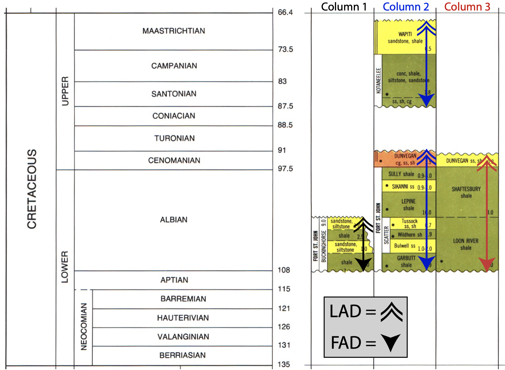
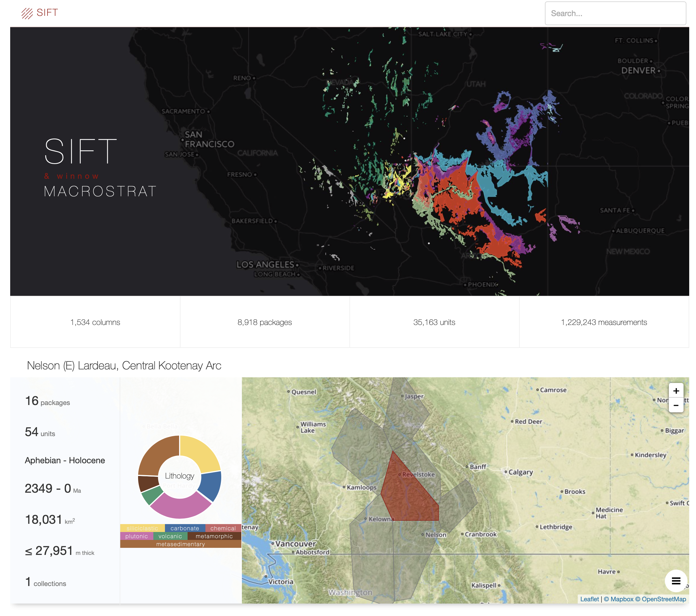
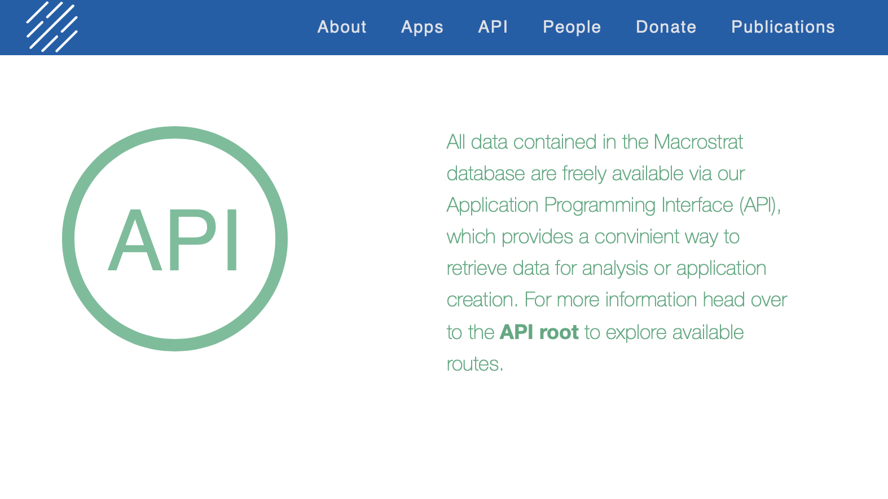
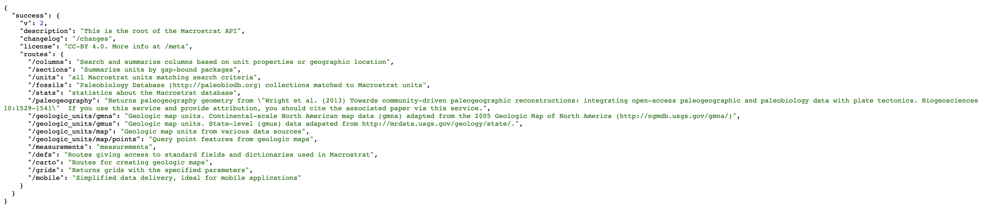

# Lab Exercise 7b: Community Diversity in the Early Devonian New Scotland Formation (samples collected on our field trip). 

## Instructions

Complete the following lab exercise and submit your answers as Word, Pages, or PDF document and your R script as a .r file by the start of lab on October 31, 2019 (:ghost: :jack_o_lantern: :skull:). Please submit your files by email to noel.heim@tufts.edu.

## Objectives
The purpose of this lab is to introduce you to the concepts of macrostratigraphy and the Macrostrat database. By the end of this lab you should be able to download Macrostrat data using the API. You will also be able to calculate macrostratigraphic parameters and compare the fossil and geological record using R.  

## Introduction
In the 1970s and 1980s the Geological Survey of Canada and the American Association of Petroleum Geologists produced a series of stratigraphic correlation charts that show the geology of North America from the crystalline basement to the surface at over 800 locations. These charts were indented to standardize the stratigraphic nomenclature of geologic units and allow geologists to easily determine which units are roughly equivalent. However, these charts also contain a wealth of information on the geology of North America, including lithology, thickness, paleoenvironments, and economic minerals. Although the effort that went into producing these charts have gone largely unnoticed by geologists, the Macrostrat database has digitized these, and similar, records in order to leverage for purposes other than correlation and name standardization. In this laboratory exercise you will use Macrostrat to explore the spatial and temporal dynamics of North American geology.


## The Nomenclature of Macrostratigraphy
* **Units**: In Macrostrat, the finest division is called a unit and roughly corresponds to a formation-level lithostratigraphic unit. The colored boxes on figure 1 below are units.
* **Packages**: The key to macrostratigraphic analysis is recognizing unconformities, or 'gaps' in the geological record. Units are stacked into gap-bound packages--a vertical sequence of units with unconformities above and below that are resolvable to approximately 1 million years. In reality, most sedimentary units will have internal unconformities that are much shorter in duration than one million years, but these are not resolvalbe in the data used to construct Macrostrat. 
* **Columns**: Packages are stacked to form stratigraphic columns that summarize the geological history of a region.
* **Initiation**: The term used to describe what happens at the FAD of a package--the initiation of rock accumulation.
* **Truncation**: The term used to describe what happens at a package's LAD--the truncation of that package.


**Figure 1** *Example of Macrostrat columns, packages, and units. The key to macrostratigraphy is that packages, because they are bound above and bleow by undonformities, or 'gaps', can be treated analytically in the same way we treat species in the fossil record. Namely, each package has times of first and last appearance.*


## Finding the Macrostrat Website
The URL for the Macrostrat is [macrostrat.org](https://macrostrat.org). Go there now in your web browser. The first thing that you should see is the **SPLASH** page. 


The Macrostrat splash page has a lot of information packed into it. At the bottom of the screen you will see some basic stats on the types and quantity of data located in the database.

Data Type | Definition
--------- | ----------
**Regional Rock Columns** | Regional summaries of the rock record in a particular place. In nearly all cases, the columns describe the record from the surface down to crystalline basement rock.
**Rock Units** | A formation-level lithostratigraphic unit. Columns are composed of units. 
**Geologic Map Polygons** | Macrostrat also has global and regional geologic maps. Each map polygon corresponds to a colored geological map unit.

If you scroll down, you will see the four major projects currently part of Macrostrat.

## Macrostrat Units & Columns

Click on the *Search* button near underneath the Macrostrat stats on the splash page.

The page you get will be a randomly selected macrostrat column, and should look something like this.


You are presented with the location of the stratigraphic column on a maps as wells as some summary statistics about the column, including the numbers of units and packages, the distribution of lithologies, age range, total thickness, and area. You are also presented with the number of collections. This refers to the the number of paleobiology Database collections that have been matched to units in the column.

#### Exercise Questions 1
Search for 'Hindsville' in the search bar at the upper right. This will take you to the summary page for the units named Hindsville.

1. Where is the Hindsville located?

2. What age is the Hindsville? Give the period and stage names.

3. How thick is the Hindsville?

4. Why are there three columns that have Hindsville units?  

5. What proportion of the Hindsville is sandstone?

6. What are the prevalent taxa found in the Hindsville?

Click on the gray polygon that contains the city of Fayetteville. This will take you to the summary page for that column.

7. What is the name of the column?

8. How thick is the column?

9. How many PBDB collections have been matched to units in this column and what are the prevalent taxa?

At the bottom of the page is a graphical rendering of the units within the column.

10. How many packages are in this column and how are the delineated on the figure?

11. How many units have PBDB collections?

12. What are the units above and below the Hindsville? Are each of these units in the same or different packages?


## Macrostrat API

Unlike the PBDB, Macrostrat does not provide a form for downloading data. However, like the PBDB, it does have an API. The API has the general form as the PBDB API, but the documentation is not nearly as verbose. To get to the API, click on the API link on the splash page. You should end up at a splash screen for the API documentation that looks like this.



To get to the main documentation click on **API root** or go directly to [macrostrat.org/api](http://macrostrat.org/api). You should see something that looks like this.



The documentation is formatted in JSON. You may want to add a free JSON parser extension for your browser. For Macs, I like JSON Peep for Safari and JSON Lite for Firefox, but there are others for other browsers and operating systems.

We want to download all the data for North America and the Caribbean. In order to do this, we need to look their project ID numbers. We can do this via the *defs* route. For the *defs* route, it is sometimes useful to have all the records returned. To do this, simply include the single parameter *all*: [https://macrostrat.org/api/defs/projects?all](https://macrostrat.org/api/defs/projects?all)

**Paste this URL into your browser and make note of the IDs for the North America and Caribbean projects.**

## Plotting marine & terrestrial rocks in North America & the Caribbean
Now we want to look at the history of marine and terrestrial sedimentation and the fossil record in North America and the Caribbean. You will do this in R drawing on your knowledge from last week's lab on using APIs to plot data in R. 

In addition to answering the questions below, you will also need to submit a .r script containing your code for downloading data, calculations, and generating your plots. This script should be well documented (i.e., explanatory comments) and should run without error. You may need to review loops and plotting from [Getting Started with R](https://github.com/naheim/rTutorials/blob/master/manipulatedf.md) and you will use skills you learned last week in [Lab 3](lab3.md).

### Step 1: Download marine packages from Macrostrat
Let's start with *marine* packages, and use the API to download the data. For our analyses here we will only be examining packages in North America and the Caribbean that contain only sedimentary rocks of marine origin. For historical reasons, the route to examine packages is called sections. Look at the documentation for the *sections* route to construct your call to the API. The parameters you want to retrieve only marine and only sedimentary rocks are *environ_class* and *lith_class*. If you are unsure what the parameter values should be, you can look up the possible values in the *defs* route (but your first guess will probably work :wink:). 

Macrostrat only offers two output formats for the sections route: JSON and csv. You can read JSON into R, but it will require additional processing. Since csv is essentially a "native" format for R, we'll use that. Make sure you include the parameter *format* and set the value to *csv*. Last week when working with PBDB downloads in R, we downloaded files with tab-delimited values (tsv). To get csv files, you'll need to use the ``read.csv`` instead of ``read.tsv()``, otherwise the two functions work the same.

Once you have downloaded your pacages, look at the column headers using either ``head()`` or ``colnames()``. Make sure you understand what information is in each of the columns.

### Step 2: Download the timescale
As in the PBDB, Macrostrat also has information on the geological timescale. Use the *intervals* route to get the time intervals of interest. You will need to specify a timescale. The timescale we are interested in is the *international ages*. Use the *defs* route to see the other available timescales. Also be sure to specify that you want a csv.

An important thing to note about web addresses is that they can only have letters, numbers, and 4 special characters (- _ . ~). In order to put any other characters, including spaces, into a web address, those characters need to be encoded as % plus a two-digit hexadecimal representation--when the web address is being read by the server, the % indicates that the next two characters should be interpreted as special characters. This is important, because when we put the timescale name, *international ages*, into our URL it has a space that needs to be encoded. The code for a space is *%20*. However, you don't need to remember this. When you put the URL with spaces or other characters directly in your web browser, the browser does the encoding for you. Likewise, R has a nifty function called ``URLencode()`` that will encode all special characters before passing it to a web server--but you have to use this function or you will get an error. Here's an example of how the function works.

````r
myWebAddress <- "https://paleobiodb.org/data1.2/taxa/single.tsv?name=Elrathia kingii"
myWebAddress # this will print the exact string with a space between the species and genus names.
# if we try to download data with this URL we will get an error
e.kingii <- read.delim(myWebAddress) # download the data--it should work

# now let's encode
myWebAddress <- URLencode("https://paleobiodb.org/data1.2/taxa/single.tsv?name=Elrathia kingii")
myWebAddress # now note that the space has been encoded.

e.kingii <- read.delim(myWebAddress) # download the data--it should work
e.kingii
````

Once you have downloaded your timescale, look at the column headers using either ``head()`` or ``colnames()``. Notice that the column names are slightly different from those used by the PBDB. Make sure you understand what information is in each of the columns.

### Step 3: Plot the number of packages, PBDB collections, and proportion of matched packages over time
To to this you will draw on what you learned last week. 

1. Set up three vectors (or one data frame) to hold your results.
2. Write a loop that steps through each time interval.
	* Count the number of packages in each time interval.
	* Count the number of PBDB collections in each time interval.
	* Calculate the proportion of packages that have PBDB collections.
3. Make one plot each for each of the three quantities you calculated inside the loop. **Be sure to write meaningful xais labels!!!**

### Step 4: Plot the number of terrestrial packages, PBDB collections, and proportion of matched packages over time
Repeat steps 1 and 3 above. You will need to change your call to the sections route of the API to return non-marine rather than marine sedimentary rocks. Also, you've already downloaded the timescale (step 2) so you won't need to do that agin. In your code, copy and paste will be helpful. 


####\*\*R PRO TIP 1
````r
# It is often useful to add names to the values in your vectors. 
# Because your vectors correspond to the rows of the timescale, you can use the interval names!

# make my vectors to hold calculations made for each time interval
nPkg <- vector(mode="numeric", length=nrow(timescale)) # set up a vector initialized with zeros
names(nPkg) <- timescale$name # add names to each value
nPkg # notice now that each place in the vector has a name that corresponds to the values in timescale$name!

# to set up other vectors you can actually just set them equal to the empty vector you just make rather than wiring out the code over and over.
nColl <- nPkg 
nColl # notice that now nColl is a vector initialized with zeros and time scale names.

# This will be useful because, lets say you want to know which interval has the most paleobiology database collections. 
# Once you've counted the number of collections in each interval and stored them in nColl, you can use max(nColl) to get both the max value and the interval that that value occurs in!
````

####\*\*R PRO TIP 2
````r
# You can combine multiple plots into a single plot window!
# Here's how.

# Open a new plot window, and set the size
quartz(height=6, width=12) # a window 6 inches high by 12 inches wide

# partition the window into a grid with 1 row and 3 columns
# this makes 3 equal-sized plot frames arranged next to each other
par(mfrow=c(1,3)) # there are many, many plot options you can control with par()

# lets make up some data
x <- rnorm(1000) # 1000 values randomly drawn from a normal distribution
y <- runif(1000) # 1000 values randomly drawn from a uniform distribution
z <- x * y # the product of x and y

# make your first plot
hist(x) # a histogram of x

# make your second plot, by calling a plotting command, you automatically move to the next plot frame
plot(x, y, xlab='Normal distribution', ylab='Uniform distribution') # note that here I made nicer axis labels

# make your third plot
boxplot(z, ylab='Normal x Uniform') # box and whisker plot
````


#### Exercise Questions 2
1. How many sedimentary marine and non-marine packages are in North American and the Caribbean?

2. What are the total numbers of marine and non-marine PBDB collections?

3. Which time interval has the most marine packages?

4. Which time interval has the most non-marine collections?

5. How are the numbers of marine packages and numbers of marine PBDB collections over time similar and different?

6. Which time intervals have the highest proportions of marine and non-marine packages with PBDB collections? 

7. Which interval has the lowest proportion of marine PBDB collections?

8. Why do you think this interval has the lowest? (Hint: you may want to think about the other EOS courses you're taking this semester.)

9. Why do you think the trends for the numbers of marine and non-marine packages are different? Why does each have the shape that id does?

10. How do the proportions of the fossil record change over time in marine and non-marine systems? 

11. What do changes in the proportions of fossiliferous packages say about the quality of the marine and non-marine fossil records?
